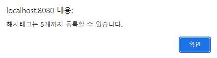

# 게시판 예제

## 게시판 프로젝트
2023.07.25 ~ 2023.07.30

## 주요 기능

- 게시글 및 댓글 읽기
- 게시글 및 댓글 작성

### 완성된 요구사항

1. 사용자는 게시글과 댓글을 읽을 수 있다.
2. 사용자는 게시글과 댓글을 작성할 수 있고, 텍스트만 가능하다.
4. 본인 확인을 위한 비밀번호는 암호화하여 DB에 저장한다.
5. 게시글에는 해시태그 최대 5개를 등록할 수 있다.

6. 게시글 목록 화면에는 게시글 전체건수와 댓글 전체건수를 표시한다.
7. 게시글 목록에는 제목, 작성자, 작성일시, 댓글 수, 조회수, 좋아요수를 표시한다.
8. 게시글 목록에서 제목, 작성자, 해시태그, 내용을 선택하여 문자열을 검색할 수 있다.

11. 게시글 목록에서 최근 3일 이내 등록된 글은 [New] 텍스트를 붙여 식별할 수 있다.
12. 게시글 목록에서 제목을 클릭하면 게시글 상세로 이동하고, 조회수를 갱신하고 건수를 확인할 수 있다.
13. 게시글 상세에서 `Like` 또는 `unlike`를 할 수 있고, Like 건수를 표시한다.
14. 삭제 처리된 댓글은 `삭제된 댓글입니다.`라고 내용 대신 메시지를 노출한다.

# 화면 구성

## 메인 페이지

- 메인 페이지 이동 버튼
- 전체 게시글 수 및 댓글 수
- 게시글 작성 버튼
- 전체 게시글 목록
  - 최신 글 순으로 확인
  - 3일 이내 작성 글에 [new]태그
- 게시글 검색

## 게시글 작성

- 제목, 작성자, 비밀번호, 내용, 해시태그 입력 후 작성

- 해시 태그 5개 이상 등록 시 오류 발생

## 게시글 상세

- 게시글 상세 내용 확인
- 게시글 좋아요

- 댓글 작성

- 댓글 입력 후

## 검색

- 제목, 작성자, 내용, 해시태그로 검색

# 기술 스택
- Back-end
  - Spring Boot 3.1.2
  - Java 17
  - Spring Security 6
  - MariaDB
- Front-end
  - NodeJS 18.17.0
  - Vue 2
  - Vuex

# 설계 문서
해당 내용들은 [링크](https://hyeonjun-kwak.notion.site/faf96d4edff34d288aa5c15fca7b2949?v=a1a7f6be6a3444f8a22b220ac2bfc1e0&pvs=4)에서 모두 확인할 수 있습니다.
- [요구사항 명세서](https://hyeonjun-kwak.notion.site/b3091a133d714d35b92e8d72b4a05b34?pvs=4)
- [테이블 명세서](https://hyeonjun-kwak.notion.site/d4b2bfb585bf42789d2c585e112719c3?pvs=4)
  - DDL 파일은 /BE/NTS_BOARD_DDL.sql입니다.
- [와이어프레임](https://www.notion.so/hyeonjun-kwak/UI-UX-ed25f298cb5b4a7b9d3a6c8f488767c2?pvs=4)
- [API 명세서](https://hyeonjun-kwak.notion.site/API-f87e82d88af44b7598e1df4e5b527b3f?pvs=4)
- [WBS](https://www.notion.so/hyeonjun-kwak/WBS-57b941cbe7dc4535a79459b2465cd545?pvs=4)

# 개선사항
- 수정, 삭제 기능 추가
- 페이징 기능 추가
